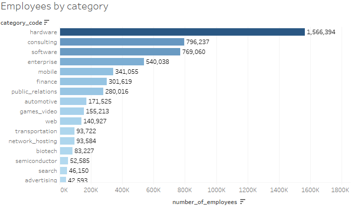
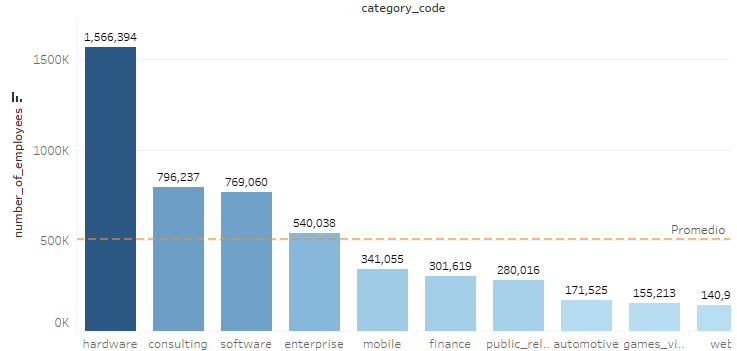
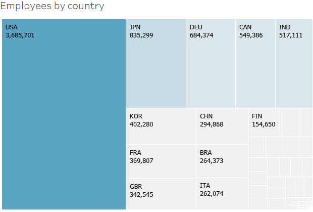
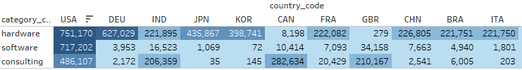
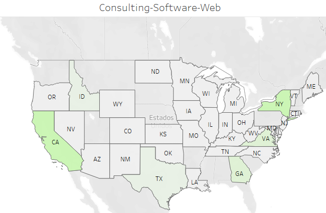
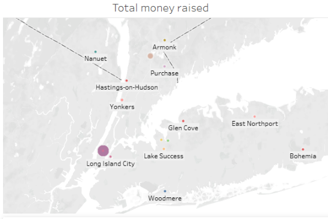
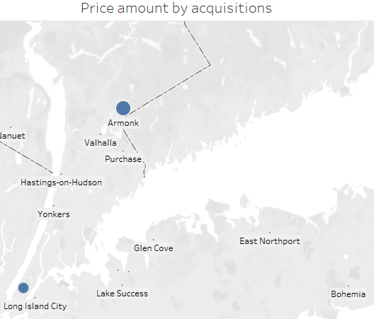
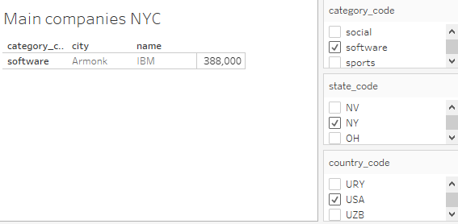

# Tableau project: companies.json

El objetivo de este proyecto fue definir un cliente o nuevo negocio con base en la información analizada, en esta ocasión se trabajó con companies.json que contiene datos de compañias de diferentes sectores y países.

### Análisis y visualización de datos:

#### __Observamos la clasificación de las compañias de acuerdo a su sector, por total de empleos.__
​  

 
#### __Seleccionando solo el top 10.__
​  

 
#### __Ahora a total de empleos un panorama con los países más representativos.__
​  

 
#### __Haciendo un cruce con la información anterior.__
​  

_El top de categorías acorde a mayor número de empleos fueron: __hardware, software y consultoría__ y entre los países con mayor registro de empleos estuvo Estados Unidos._

#### __A continuacion nos enfocaremos en Estados Unidos y visualizaremos los estados con mayor número de empleos en las categorías de software, consultoría y web.__ 
​  

#### Poniendo foco en Nueva York que destaca ligeramente de California, realizamos las siguientes visualizaciones:
##### Total dinero generado
​  

##### Precio de adquisición
​  

_Más ideas derivadas del análisis y visualización de los datos:_
- Los principales estados con mayor empleo en el sector tecnológico son California y Nueva York. Siendo NY ligeramente superior a CA (430k vs 410k).
- Dentro de Nueva York destacan las ciudades de Long Island y Armonk (en la cual se encuentra la sede de IBM).
​  

_Haciendo más investigación sobre los puntos anteriores:_
- Además de California y Florida, Nueva York también es un estado donde las startups registran un alto índice de [ganancias](https://www.kaggle.com/farhanmd29/50-startups).
- Acorde a la [oferta de empleos](https://www.kaggle.com/new-york-city/new-york-city-current-job-postings) durante Diciembre de 2019 en NYC, la categoría de Technology, Data & Innovation fue de las más representativas en el mercado, con un 11%, tan solo después de Engineering, Architecture, & Planning que registró un 12%.

__A partir de lo anterior, se plantea como propuesta la creación de un coding bootcamp en, o los alrededores de NYC, el enfoque sería capacitar a las personas que tengan interés en desarrollo web y análisis de datos y que no cuenten con una formación acádemica formal.__

_¿Pero... qué tenemos que condiderar si elegimos uno de los estados con mayor índice de startups y oferta de coding bootcamps?_
- Algunos de los diferenciadores frente a la competencia serían la duración y el costo del bootcamp, el cual podría adecuarse a un mercado como el de hispanohablantes y/o nativos que no tienen una formación profesional comprobable pero cuentan con los skills para aplicar a una vacante del giro tecnologíco. Actualmente el promedio de costo está alrededor de 16Kusd con una duración de 15 semanas.
- Sería interesante también analizar la proyección de [crecimiento de la población en NY](https://www.kaggle.com/pcharambira/new-york-city-population) que se hizo de 2010 a 2040 por grupos de edad y por región.
- Evidentemente es necesario un ánalisis de mercado en el área elegida para detectar fortalezas, debilidades y retos para descartar esta ciudad o elegir alguna zona a su alrededor.
- Actualmente el posicionamiento orgánico de la competencia no es relevante, es más frecuente encontrar sitios que concentren esta información, por ejemplo:

NYC
+ https://www.switchup.org/rankings/best-bootcamps-new-york-city
+ https://www.builtinnyc.com/2017/10/11/nyc-coding-bootcamp-schools
+ https://www.thebalancecareers.com/coding-bootcamps-in-nyc-2071394
+ https://www.bloc.io/learn-to-code/coding-bootcamps/states/new-york
+ https://www.ikream.com/5-best-coding-bootcamp-schools-in-nyc-2020-31988

NYC-Long Island
+ https://www.coursereport.com/cities/long-island
+ https://www.certstaff.com/classes/categoryschedule+location_id+2615+category_id+182.html

